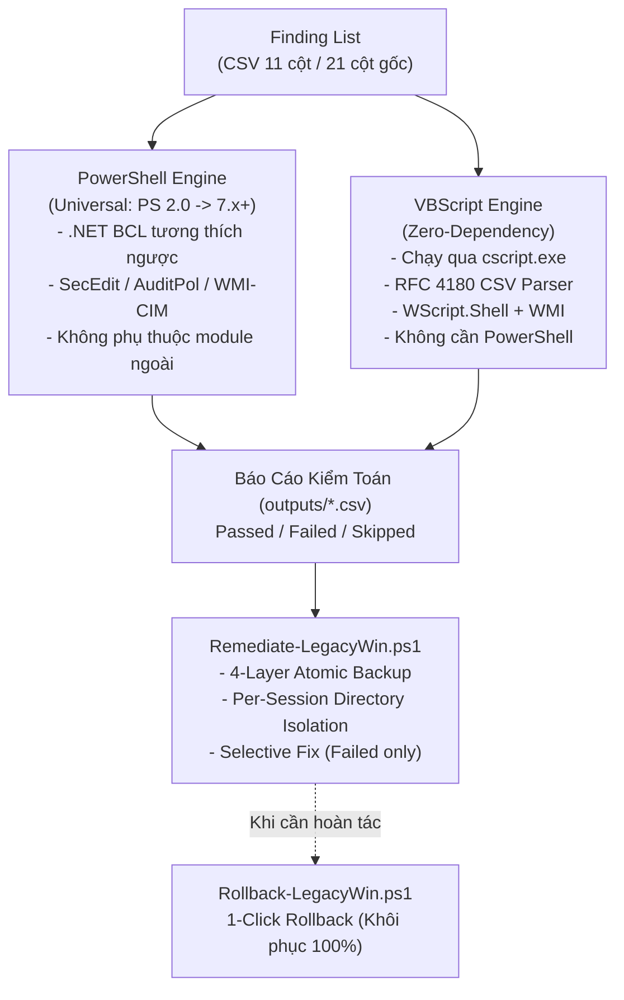

# HardeningNCS

> Bộ công cụ kiểm toán (Audit) và thiết lập cấu hình an toàn (Hardening) chuẩn CIS Benchmark đa nền tảng Windows với khả năng tương thích toàn diện mọi phiên bản PowerShell (PowerShell 2.0, 3.0, 4.0, 5.1, 7.x+) và VBScript.


---

## Mục Lục

- [Giới Thiệu Tổng Quan](#giới-thiệu-tổng-quan)
- [Khả Năng Tương Thích PowerShell Toàn Năng](#khả-năng-tương-thích-powershell-toàn-năng)
- [Kiến Trúc Dual-Engine](#kiến-trúc-dual-engine)
- [Cấu Trúc Thư Mục](#cấu-trúc-thư-mục)
- [Cài Đặt & Triển Khai](#cài-đặt--triển-khai)
- [Hướng Dẫn Sử Dụng](#hướng-dẫn-sử-dụng)
  - [Bước 1: Khảo sát & Kiểm toán (Audit)](#bước-1-khảo-sát--kiểm-toán-audit)
  - [Bước 2: Mô phỏng thiết lập (What-If Simulation)](#bước-2-mô-phỏng-thiết-lập-what-if-simulation)
  - [Bước 3: Khắc phục chọn lọc (Selective Remediation)](#bước-3-khắc-phục-chọn-lọc-selective-remediation)
  - [Bước 4: Phục hồi 1-Click (Rollback)](#bước-4-phục-hồi-1-click-rollback)
- [Quy Chuẩn Dữ Liệu CSV](#quy-chuẩn-dữ-liệu-csv)
- [Hệ Thống Kiểm Định Tự Động (QA & Testing)](#hệ-thống-kiểm-định-tự-động-qa--testing)
- [Chính Sách An Toàn (Safety Guardrails)](#chính-sách-an-toàn-safety-guardrails)
- [Bảng Ma Trận Tương Thích Hệ Điều Hành](#bảng-ma-trận-tương-thích-hệ-điều-hành-os-compatibility-matrix)
- [Giấy Phép (License)](#giấy-phép-license)

---

## Giới Thiệu Tổng Quan

**HardeningNCS** là bộ giải pháp mã nguồn mở phục vụ công tác rà soát, kiểm toán an ninh thông tin và thiết lập cấu hình an toàn chuẩn hóa theo **CIS Benchmark** trên toàn bộ hệ sinh thái Windows — từ các phiên bản thế hệ cũ (Legacy EOL) đến các hệ điều hành máy trạm và máy chủ hiện đại nhất.

Mục tiêu cốt lõi của công cụ là **tối giản hóa quy trình kiểm toán**: Chạy được ngay lập tức trên bất kỳ hệ thống Windows nào mà không đòi hỏi người dùng phải nâng cấp phiên bản PowerShell, không cần cài thêm thư viện phụ thuộc (.NET runtime mới hay module ngoài), và cung cấp cơ chế hoàn tác (Rollback) an toàn tuyệt đối.

---

## Khả Năng Tương Thích PowerShell Toàn Năng

Bộ công cụ được tối ưu từ mức sàn tối thiểu để hoạt động trơn tru trên **tất cả các phiên bản PowerShell**:

| Phiên Bản PowerShell | Môi Trường Mặc Định | Cơ Chế Tương Thích Trong HardeningNCS |
| :--- | :--- | :--- |
| **PowerShell 2.0** | Windows 7 SP1, Windows Server 2008 R2 | Hỗ trợ out-of-the-box (.NET 2.0/3.5 BCL), không dùng cú pháp PS 3.0+. |
| **PowerShell 3.0** | Windows 8, Windows Server 2012 | Tương thích ngược hoàn toàn, tự động tối ưu hóa bộ nhớ đệm. |
| **PowerShell 4.0** | Windows 8.1, Windows Server 2012 R2 | Tương thích ngược hoàn toàn, quản lý pipeline mượt mà. |
| **Windows PowerShell 5.1** | Windows 10, Windows 11, Windows Server 2016 / 2019 / 2022 / 2025 | Môi trường khuyến nghị phổ biến nhất, tốc độ xử lý nhanh, ổn định cao. |
| **PowerShell 7.x+ (Core / `pwsh`)** | Đa nền tảng (.NET 6/7/8/9) | Module `Invoke-WmiCompat.ps1` tự động kích hoạt `Get-CimInstance`, giải quyết triệt để việc PS Core loại bỏ `Get-WmiObject`; chuẩn hóa Unicode BOM tránh lỗi parser. |
| **VBScript Engine** | Mọi phiên bản Windows từ Windows 2000 đến Windows 11 | Zero-dependency qua `cscript.exe //nologo`, cứu cánh khi PowerShell bị cấm hoàn toàn. |

---

## Kiến Trúc Dual-Engine



1. **PowerShell Engine (`src/Audit-LegacyWin.ps1`)**:
   - Engine kiểm toán chính. Tự động nhận diện runtime và điều phối lệnh phù hợp cho cả PowerShell cổ điển (2.0 - 5.1) lẫn hiện đại (7.x+).
   - Xử lý mượt mà cả file checklist 11 cột lẫn file 21 cột gốc của CIS Benchmark / HardeningKitty (324+ rules).
2. **VBScript Engine (`src/Audit-LegacyWin.vbs`)**:
   - Zero-dependency: Chạy trực tiếp qua `cscript.exe //nologo` có sẵn trên mọi bản Windows.
   - Tích hợp bộ parser **RFC 4180 State Machine** xử lý chính xác dấu phẩy nằm trong dấu ngoặc kép.
   - Tự động lập bảng ánh xạ cột động (**Dynamic Header-to-Index Mapping**), không phụ thuộc vào thứ tự cột.

---

## Cấu Trúc Thư Mục

```text
HardeningNCS/
|-- lists/                                                 # Danh mục kiểm toán CIS Benchmark (CSV)
|   |-- Windows/                                           # 368 file checklist CIS, DISA STIG, MSCT cho mọi Windows
|   |   |-- CIS_MS_Windows_Server_2008_R2_MS_Level_1_v3.3.1.csv
|   |   |-- CIS_MS_Windows_Server_2012_R2_Level_1_v3.0.0.csv
|   |   |-- CIS_Microsoft_Windows_Server_2019_v5.0.0_L1_MS.csv
|   |   |-- CIS_Microsoft_Windows_Server_2022_v5.1.0_L1_MS.csv
|   |   |-- CIS_Microsoft_Windows_Server_2025_v2.1.0_L1_MS.csv
|   |   |-- CIS_MS_Windows_7_v3.2.0_Level_1.csv
|   |   |-- CIS_Microsoft_Windows_10_Enterprise_v5.0.0_L1.csv
|   |   `-- CIS_Microsoft_Windows_11_Enterprise_v5.1.0_L1.csv
|   |-- finding_list_cis_server2008r2_machine.csv          # Baseline 11 cột Server 2008 R2
|   |-- finding_list_cis_win7_sp1_machine.csv              # Baseline 11 cột Windows 7 SP1
|   `-- finding_list_cis_server2012r2_machine.csv          # Baseline 11 cột Server 2012 R2
|-- src/                                                   # Mã nguồn các Engine thực thi
|   |-- Audit-LegacyWin.ps1                                # Engine Audit PowerShell (Universal PS 2.0 -> 7.x+)
|   |-- Audit-LegacyWin.vbs                                # Engine Audit VBScript Zero-Dependency
|   |-- Remediate-LegacyWin.ps1                            # Engine Fix có kiểm soát & 4-Layer Backup
|   |-- Rollback-LegacyWin.ps1                             # Engine Hoàn tác 1-Click
|   `-- common/                                            # Thư viện hàm phụ trợ dùng chung
|       |-- Compare-Value.ps1                              # Bộ so sánh toán tử (=, !=, >=, <=, <=!0, regex)
|       |-- Invoke-WmiCompat.ps1                           # Cầu nối WMI/CIM xuyên phiên bản PowerShell
|       |-- Parse-SecEdit.ps1                              # Xuất & phân tích secedit INF
|       `-- Parse-AuditPol.ps1                             # Thu thập & phân tích Advanced Audit Policy
|-- tests/                                                 # 8 Test Suites kiểm định tự động hóa
|   |-- Test-PS2Compat.ps1                                 # Static AST Linter: cấm cú pháp PS 3.0+
|   |-- Test-Audit-Smoke.ps1                               # Smoke test kiểm chứng schema báo cáo
|   |-- Test-Rollback.ps1                                  # Integration Test: E2E Fix -> Rollback
|   |-- test_common_helpers.ps1                            # 68 unit tests toán tử & parser
|   |-- test_csv_schema.ps1                                # Kiểm định toàn vẹn file CSV
|   |-- test_audit_engine.ps1                              # 36 tests dispatch engine & parity
|   |-- test_remediate_rollback.ps1                        # 44 tests an toàn backup & lockfile
|   `-- test_vbs_audit.ps1                                 # 17 tests VBScript Engine
|-- outputs/                                               # Thư mục lưu báo cáo kiểm toán và backup sessions
`-- tools/
    `-- accesschk.exe.url                                  # Shortcut Sysinternals AccessChk
```

---

## Cài Đặt & Triển Khai

### 1. Tải mã nguồn về máy quản trị
```cmd
git clone https://github.com/Agents-Coding-Space/HardeningNCS.git
cd HardeningNCS
```

### 2. Triển khai lên máy đích (Bất kỳ bản Windows nào)
- **Qua mạng (SSH / SCP):**
  ```bash
  scp -r src lists outputs tests vagrant@<IP_TARGET>:C:/HardeningNCS/
  ```
- **Môi trường cô lập (Air-Gapped qua USB):**
  Sao chép toàn bộ thư mục `HardeningNCS` vào USB và dán vào máy đích (ví dụ: `C:\HardeningNCS`).

> **Lưu ý quan trọng:** Mở Command Prompt hoặc PowerShell dưới quyền **Run as Administrator** để có đủ đặc quyền kiểm toán bảo mật (`SeSecurityPrivilege`) cho `secedit.exe` và `auditpol.exe`.

---

## Hướng Dẫn Sử Dụng

### Bước 1: Khảo Sát & Kiểm Toán (Audit)

#### Cách A — Chạy bằng PowerShell (Khuyến nghị — Hỗ trợ từ PS 2.0 đến PS 7.x+)
Mở PowerShell bình thường và thực thi (không cần tham số `-Version 2` nếu máy đã có PS hiện đại):
```powershell
powershell.exe -ExecutionPolicy Bypass -File .\src\Audit-LegacyWin.ps1 `
  -FindingList .\lists\Windows\CIS_MS_Windows_Server_2008_R2_MS_Level_1_v3.3.1.csv `
  -OutputDir .\outputs
```
*(Nếu đang sử dụng PowerShell 7, có thể chạy thẳng bằng `pwsh -File .\src\Audit-LegacyWin.ps1 ...`)*.

#### Cách B — Chạy bằng VBScript (Zero-Dependency)
Dành cho máy chủ bị khóa chính sách thực thi PowerShell:
```cmd
cscript.exe //nologo .\src\Audit-LegacyWin.vbs .\lists\Windows\CIS_MS_Windows_Server_2008_R2_MS_Level_1_v3.3.1.csv .\outputs
```

Báo cáo kiểm toán được xuất ra tại `outputs\audit_report_<timestamp>.csv` gồm 13 cột chi tiết (`ID`, `Category`, `Name`, `Method`, `CurrentValue`, `RecommendedValue`, `Status`...).

---

### Bước 2: Mô Phỏng Thiết Lập (What-If Simulation)

**Nguyên tắc an toàn:** Luôn chạy chế độ mô phỏng trước để biết trước công cụ sẽ thay đổi những gì, **cam kết 100% không chạm vào hệ thống**:
```powershell
powershell.exe -ExecutionPolicy Bypass -File .\src\Remediate-LegacyWin.ps1 `
  -AuditReport .\outputs\audit_report_20261009_011408.csv `
  -FindingList .\lists\Windows\CIS_MS_Windows_Server_2008_R2_MS_Level_1_v3.3.1.csv `
  -WhatIf
```

---

### Bước 3: Khắc Phục Chọn Lọc (Selective Remediation)

Khi đã rà soát kỹ bản mô phỏng, chạy lệnh sửa thật:
1. **Chỉ tác động lên các mục có `Status = Failed`**.
2. **Kích hoạt cơ chế Sao lưu 4 lớp (4-Layer Atomic Backup)** trước khi ghi bất kỳ giá trị nào.
3. Tạo thư mục phiên cô lập `outputs\backup_session_yyyyMMdd_HHmmss_<PID>_<RND>` được khóa bằng **Win32 Exclusive Lockfile**.
4. Nếu có bất kỳ lỗi sao lưu nào $\rightarrow$ **Dừng ngay lập tức (Abort Gate)** và tự động dọn sạch rác, không thay đổi hệ thống.

```powershell
powershell.exe -ExecutionPolicy Bypass -File .\src\Remediate-LegacyWin.ps1 `
  -AuditReport .\outputs\audit_report_20261009_011408.csv `
  -FindingList .\lists\Windows\CIS_MS_Windows_Server_2008_R2_MS_Level_1_v3.3.1.csv
```

---

### Bước 4: Phục Hồi 1-Click (Rollback)

Nếu phần mềm nghiệp vụ trên máy chủ phát sinh xung đột sau khi hardening, sử dụng đường dẫn file `backup_manifest.txt` được in ở cuối Bước 3 để hoàn tác:

```powershell
powershell.exe -ExecutionPolicy Bypass -File .\src\Rollback-LegacyWin.ps1 `
  -ManifestFile .\outputs\backup_session_20261009_011952_1856_6325\backup_manifest.txt
```

**Cơ chế phục hồi:**
- Khôi phục các giá trị Registry cũ qua file `.reg`.
- **Tự động xóa sạch các Registry Key và Value mới tạo** qua `registry_undo_delete.reg`.
- Nạp lại Local Security Policy cũ bằng `secedit.exe /configure`.
- Nạp lại Audit Policy cũ bằng `auditpol.exe /restore`.
- Khôi phục chế độ khởi động của Windows Services theo snapshot.
- Đưa hệ thống về đúng 100% hiện trạng ban đầu trước remediation.

---

## Quy Chuẩn Dữ Liệu CSV

### 1. Schema 21 Cột Gốc (CIS Benchmark / HardeningKitty)
Được bảo toàn nguyên vẹn 100% cấu trúc:
```text
ID,Category,Name,Method,MethodArgument,RegistryPath,RegistryItem,RegistryPathIntune,RegistryPathDCP,RegistryItemIntune,ClassName,Namespace,Property,DefaultValue,DefaultValueIntune,RecommendedValue,RecommendedValueIntune,Operator,OperatorIntune,Severity,Filter
```

### 2. Schema 11 Cột Thu Gọn (Machine Specific)
```text
ID,Category,Name,Method,MethodArgument,RegistryPath,RegistryItem,DefaultValue,RecommendedValue,Operator,Severity
```

### 3. Bảng Phương Thức Kiểm Toán (Method Adapters)

| Method | Mô Tả Kiểm Toán | Nguồn Thu Thập Dữ Liệu | Khả Năng Remediate |
| :--- | :--- | :--- | :---: |
| `Registry` | Đọc khóa Registry hệ thống | Registry Provider / WMI StdRegProv |  |
| `service` | Chế độ khởi động Windows Service | WMI / CIM (`StartMode`) |  |
| `secedit` | Chính sách bảo mật cục bộ | `secedit.exe /export` (`SECURITYPOLICY`) |  |
| `accountpolicy`| Chính sách mật khẩu & lockout | `secedit` / fallback `net accounts` |  |
| `auditpol` | Nhật ký nâng cao Advanced Audit | `auditpol.exe /get /category:* /r` |  |
| `localaccount` | Trạng thái tài khoản SID 500/501 | WMI / CIM `Win32_UserAccount` |  |
| `accesschk` | Phân quyền User Rights Assignment | `secedit [Privilege Rights]` (Dịch SID) | -yellow.svg) |
| `command` | Kiểm tra phần mềm bảo mật (EMET) | Registry Uninstall Key (An toàn) |  |

---

## Hệ Thống Kiểm Định Tự Động (QA & Testing)

Dự án tích hợp sẵn **8 bộ test suite** tự động hóa kiểm định tính an toàn và tương thích:

```powershell
# 1. Kiểm tra 100% cú pháp thuần PowerShell 2.0 (Cấm PS 3.0+):
powershell -ExecutionPolicy Bypass -File .\tests\Test-PS2Compat.ps1

# 2. Kiểm thử 68 unit tests cho toán tử và parser:
powershell -ExecutionPolicy Bypass -File .\tests\test_common_helpers.ps1

# 3. Kiểm định toàn vẹn schema CSV 11 cột và 21 cột gốc:
powershell -ExecutionPolicy Bypass -File .\tests\test_csv_schema.ps1

# 4. Kiểm thử 36 kịch bản dispatch của Audit Engine:
powershell -ExecutionPolicy Bypass -File .\tests\test_audit_engine.ps1

# 5. Kiểm thử 17 kịch bản cho VBScript Engine:
powershell -ExecutionPolicy Bypass -File .\tests\test_vbs_audit.ps1

# 6. Kiểm thử 44 kịch bản an toàn Backup 4 lớp, Lockfile và Rollback:
powershell -ExecutionPolicy Bypass -File .\tests\test_remediate_rollback.ps1

# 7. Smoke test kiểm toán toàn diện:
powershell -ExecutionPolicy Bypass -File .\tests\Test-Audit-Smoke.ps1

# 8. Integration test E2E thực tế trên Registry:
powershell -ExecutionPolicy Bypass -File .\tests\Test-Rollback.ps1
```

---

## Chính Sách An Toàn (Safety Guardrails)

- **Anti-Hang Protection**: Không sử dụng vòng lặp vô hạn; các tiến trình `secedit.exe` và `auditpol.exe` đều có cờ im lặng `/quiet` và bắt ngoại lệ chặt chẽ.
- **Chống False-Pass cho `accesschk`**: Khi thiếu quyền thu thập `[Privilege Rights]`, công cụ đánh dấu rõ `Skipped`, tuyệt đối không so sánh rỗng bằng rỗng để báo `Passed` sai thực tế.
- **Cô Lập Thư Mục Phiên (Per-Session Isolation)**: Toàn bộ backup được lưu trong `backup_session_*` riêng biệt và khóa bằng `FileMode.CreateNew` ở cấp OS Kernel, ngăn ngừa va chạm giữa các phiên chạy đồng thời.
- **Chống Path Traversal**: Tên thư mục session được kiểm tra nghiêm ngặt, chặn các ký tự `\`, `/`, `:`, `..` để không ghi đè ra ngoài thư mục `outputs/`.

---

## Bảng Ma Trận Tương Thích Hệ Điều Hành (OS Compatibility Matrix)

Dưới đây là bảng tổng hợp chi tiết toàn bộ các hệ điều hành Windows được hỗ trợ, phiên bản PowerShell mặc định, và tình trạng checklist có sẵn trong thư mục `lists/Windows/`:

| Hệ Điều Hành | Phiên Bản NT | PS Mặc Định | Hỗ Trợ PowerShell | Hỗ Trợ VBScript | Trạng Thái Checklist trong `lists/Windows/` |
| :--- | :---: | :---: | :---: | :---: | :--- |
| **Windows XP SP3** | NT 5.1 | Không có | Cài thêm PS 2.0 | ✅ Hỗ trợ (Zero-Dep) | CIS Benchmark XP, DISA STIG |
| **Windows Server 2003 / R2** | NT 5.2 | Không có | Cài thêm PS 2.0 | ✅ Hỗ trợ (Zero-Dep) | CIS Benchmark Server 2003 |
| **Windows Vista SP2** | NT 6.0 | PS 2.0 (WMF) | ✅ PS 2.0 | ✅ Hỗ trợ | DISA STIG Windows Vista |
| **Windows Server 2008 SP2** | NT 6.0 | PS 2.0 (WMF) | ✅ PS 2.0 | ✅ Hỗ trợ | CIS Server 2008 v3.3.1 (DC, MS, L1, L2) |
| **Windows 7 SP1** | NT 6.1 | PS 2.0 | ✅ PS 2.0 - 5.1 | ✅ Hỗ trợ | CIS Windows 7 v3.2.0 (L1, L2, BitLocker) |
| **Windows Server 2008 R2 SP1**| NT 6.1 | PS 2.0 | ✅ PS 2.0 - 5.1 | ✅ Hỗ trợ | CIS Server 2008 R2 v3.3.1 (DC, MS, L1, L2) |
| **Windows 8** | NT 6.2 | PS 3.0 | ✅ PS 3.0 - 5.1 | ✅ Hỗ trợ | CIS Windows 8 Level 1 v1.0.0 |
| **Windows Server 2012** | NT 6.2 | PS 3.0 | ✅ PS 3.0 - 5.1 | ✅ Hỗ trợ | CIS Server 2012 v3.0.0 (DC, MS, L1, L2) |
| **Windows 8.1** | NT 6.3 | PS 4.0 | ✅ PS 4.0 - 5.1 | ✅ Hỗ trợ | CIS Windows 8.1 v2.4.1 (L1, L2, BitLocker) |
| **Windows Server 2012 R2** | NT 6.3 | PS 4.0 | ✅ PS 4.0 - 5.1 | ✅ Hỗ trợ | CIS Server 2012 R2 v3.0.0 (DC, MS, L1, L2), DISA STIG |
| **Windows 10 (1507 — 22H2)** | NT 10.0 | PS 5.0 / 5.1 | ✅ PS 5.1 / PS 7+ | ✅ Hỗ trợ | CIS Windows 10 v5.0.0 (L1, L2, Stand-alone), MSCT |
| **Windows Server 2016** | NT 10.0 | PS 5.1 | ✅ PS 5.1 / PS 7+ | ✅ Hỗ trợ | CIS Server 2016 v4.0.0 (DC, MS, L1, L2), DISA STIG |
| **Windows Server 2019** | NT 10.0 | PS 5.1 | ✅ PS 5.1 / PS 7+ | ✅ Hỗ trợ | CIS Server 2019 v5.0.0 (DC, MS, L1, L2), DISA STIG |
| **Windows 11 (21H2 — 24H2)** | NT 10.0 | PS 5.1 | ✅ PS 5.1 / PS 7+ | ✅ Hỗ trợ | CIS Windows 11 v5.1.0 (L1, L2, Stand-alone), MSCT |
| **Windows Server 2022** | NT 10.0 | PS 5.1 | ✅ PS 5.1 / PS 7+ | ✅ Hỗ trợ | CIS Server 2022 v5.1.0 (DC, MS, L1, L2), DISA STIG |
| **Windows Server 2025** | NT 10.0 | PS 5.1 | ✅ PS 5.1 / PS 7+ | ✅ Hỗ trợ | CIS Server 2025 v2.1.0 (DC, MS, L1, L2), MSCT |

---

## Giấy Phép (License)

Dự án được phát hành theo giấy phép **MIT License**.
