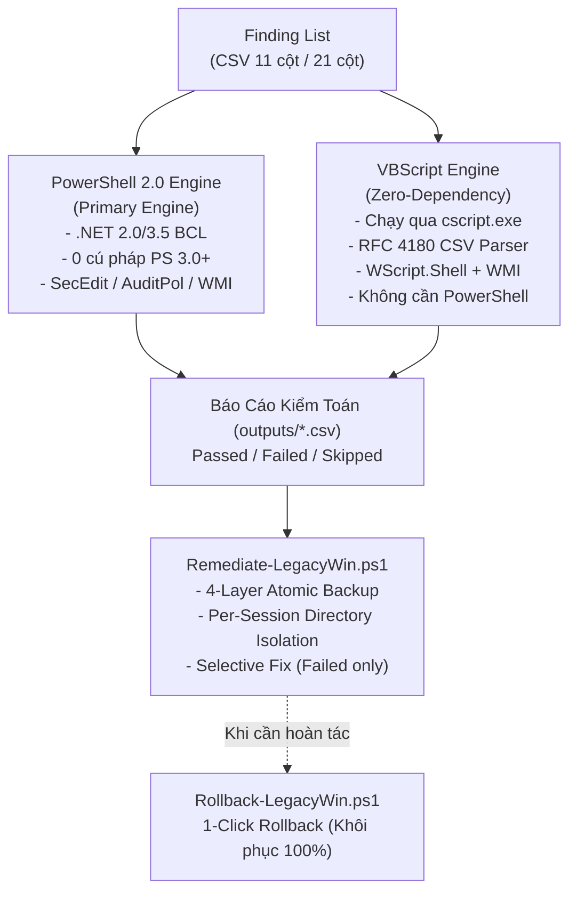

# HardeningNCS

> Bộ công cụ kiểm toán (Audit) và thiết lập cấu hình an toàn (Hardening) chuẩn CIS Benchmark cho hệ điều hành Windows thế hệ cũ (Dual-Engine: PowerShell 2.0+ & VBScript).


---

## Mục Lục

- [Giới Thiệu Tổng Quan](#giới-thiệu-tổng-quan)
- [Kiến Trúc Dual-Engine](#kiến-trúc-dual-engine)
- [Cấu Trúc Thư Mục](#cấu-trúc-thư-mục)
- [Cài Đặt & Triển Khai](#cài-đặt--triển-khai)
- [Hướng Dẫn Sử Dụng](#hướng-dẫn-sử-dụng)
  - [Bước 1: Khảo sát & Kiểm toán (Audit)](#bước-1-khảo-sát--kiểm-toán-audit)
  - [Bước 2: Mô phỏng thiết lập (What-If Simulation)](#bước-2-mô-phỏng-thiết-lập-what-if-simulation)
  - [Bước 3: Khắc phục chọn lọc (Selective Remediation)](#bước-3-khắc-phục-chọn-lọc-selective-remediation)
  - [Bước 4: Phục hồi 1-Click (Rollback)](#bước-4-phục-hồi-1-click-rollback)
- [Quy Chuẩn Dữ Liệu CSV](#quy-chuẩn-dữ-liệu-csv)
- [Hệ Thống Kiểm Định Tự Động (QA & Testing)](#hệ-thống-kiểm-định-tự-động-qa--testing)
- [Chính Sách An Toàn (Safety Guardrails)](#chính-sách-an-toàn-safety-guardrails)
- [Giấy Phép (License)](#giấy-phép-license)

---

## Giới Thiệu Tổng Quan

**HardeningNCS** là bộ giải pháp mã nguồn mở phục vụ công tác rà soát, kiểm toán an ninh thông tin và thiết lập cấu hình an toàn chuẩn hóa theo **CIS Benchmark** trên các hệ điều hành Windows thế hệ cũ (Legacy Windows):
- **Windows 7 SP1** (Máy trạm Client)
- **Windows Server 2008 R2** (Máy chủ Server)
- **Windows Server 2012 / 2012 R2** (Máy chủ Server)

### Bối Cảnh & Vấn Đề Kỹ Thuật
Các công cụ hardening hiện đại (tiêu biểu như *HardeningKitty*) được tối ưu cho PowerShell 5.1, .NET Framework 4.5+ và các module chỉ xuất hiện từ Windows 10 / Server 2016 trở lên. Khi vận hành trên các máy chủ cũ chưa cài đặt WMF 5.1:
1. Script bị lỗi cú pháp parser hoặc thiếu cmdlet (`Get-ItemPropertyValue`, `Get-CimInstance`, `Get-LocalUser`) gây **crash ngay khi khởi động**.
2. Máy chủ bị khóa chính sách thực thi PowerShell (`Restricted`) hoặc bị AppLocker chặn chạy file `.ps1`.
3. Chế độ can thiệp tự động (Remediation) thiếu khả năng xóa các Registry Key/Value mới tạo khi cần hoàn tác (Rollback).

**HardeningNCS** giải quyết triệt để các rào cản trên bằng cơ chế **Dual-Engine** chạy song song.

---

## Kiến Trúc Dual-Engine



1. **PowerShell 2.0 Engine (`src/Audit-LegacyWin.ps1`)**:
   - Tương thích 100% với PowerShell 2.0 mặc định của Windows 7 SP1 và Windows Server 2008 R2.
   - Tuyệt đối không sử dụng cú pháp PS 3.0+ (không dùng `[pscustomobject]`, `[ordered]`, `$PSScriptRoot`, `Get-CimInstance`).
   - Xử lý trực tiếp file checklist 21 cột gốc của CIS Benchmark (324+ rules).
2. **VBScript Engine (`src/Audit-LegacyWin.vbs`)**:
   - Zero-dependency: Chạy trực tiếp qua `cscript.exe //nologo` có sẵn trên mọi bản Windows từ Windows 2000 đến nay.
   - Tích hợp bộ parser **RFC 4180 State Machine** xử lý chính xác dấu phẩy nằm trong dấu ngoặc kép.
   - Tự động lập bảng ánh xạ cột động (**Dynamic Header-to-Index Mapping**), không phụ thuộc vào thứ tự cột.

---

## Cấu Trúc Thư Mục

```text
HardeningNCS/
|-- lists/                                                 # Danh mục kiểm toán CIS Benchmark (CSV)
|   |-- CIS_MS_Windows_Server_2008_R2_MS_Level_1_v3.3.1.csv# Baseline 21 cột gốc (324 rules)
|   |-- finding_list_cis_server2008r2_machine.csv          # Baseline 11 cột cốt lõi Server 2008 R2
|   |-- finding_list_cis_win7_sp1_machine.csv              # Baseline 11 cột cốt lõi Windows 7 SP1
|   `-- finding_list_cis_server2012r2_machine.csv          # Baseline 11 cột cốt lõi Server 2012 R2
|-- src/                                                   # Mã nguồn các Engine thực thi
|   |-- Audit-LegacyWin.ps1                                # Engine Audit PowerShell 2.0 thuần
|   |-- Audit-LegacyWin.vbs                                # Engine Audit VBScript Zero-Dependency
|   |-- Remediate-LegacyWin.ps1                            # Engine Fix có kiểm soát & 4-Layer Backup
|   |-- Rollback-LegacyWin.ps1                             # Engine Hoàn tác 1-Click
|   `-- common/                                            # Thư viện hàm phụ trợ (PS2 compatible)
|       |-- Compare-Value.ps1                              # Bộ so sánh toán tử (=, !=, >=, <=, <=!0, regex)
|       |-- Parse-SecEdit.ps1                              # Xuất & phân tích secedit INF
|       `-- Parse-AuditPol.ps1                             # Thu thập & phân tích Advanced Audit Policy
|-- tests/                                                 # 8 Test Suites kiểm định tự động hóa
|   |-- Test-PS2Compat.ps1                                 # Static AST Linter: cấm cú pháp PS 3.0+
|   |-- Test-Audit-Smoke.ps1                               # Smoke test kiểm chứng schema báo cáo
|   |-- Test-Rollback.ps1                                  # Integration Test: E2E Fix -> Rollback
|   |-- test_common_helpers.ps1                            # 68 unit tests toán tử & parser
|   |-- test_csv_schema.ps1                                # Kiểm định toàn vẹn file CSV
|   |-- test_audit_engine.ps1                              # 36 tests dispatch engine & parity
|   |-- test_remediate_rollback.ps1                        # 44 tests an toàn backup & lockfile
|   `-- test_vbs_audit.ps1                                 # 17 tests VBScript Engine
|-- outputs/                                               # Thư mục lưu báo cáo và backup sessions
`-- tools/
    `-- accesschk.exe.url                                  # Shortcut Sysinternals AccessChk
```

---

## Cài Đặt & Triển Khai

### 1. Tải mã nguồn về máy quản trị
Giải nén mã nguồn hoặc clone kho lưu trữ về máy:
```cmd
git clone <repository_url>
cd HardeningNCS
```

### 2. Triển khai lên máy đích (Windows 7 / Server 2008 R2 / 2012 R2)
- **Môi trường kết nối mạng (SSH / SCP):**
  ```bash
  scp -r src lists outputs tests vagrant@<IP_TARGET>:C:/HardeningNCS/
  ```
- **Môi trường cô lập (Air-Gapped qua USB):**
  Copy toàn bộ thư mục `HardeningNCS` vào USB và dán vào thư mục trên máy đích (ví dụ: `C:\HardeningNCS`).

> **Lưu ý quan trọng:** Mở Command Prompt hoặc PowerShell dưới quyền **Run as Administrator** để có đủ đặc quyền kiểm toán bảo mật (`SeSecurityPrivilege`) cho `secedit.exe` và `auditpol.exe`.

---

## Hướng Dẫn Sử Dụng

### Bước 1: Khảo Sát & Kiểm Toán (Audit)

#### Cách A — Chạy bằng PowerShell 2.0 (Khuyến nghị)
Sử dụng file baseline 21 cột gốc chuẩn của CIS Benchmark:
```powershell
powershell.exe -ExecutionPolicy Bypass -File .\src\Audit-LegacyWin.ps1 `
  -FindingList .\lists\CIS_MS_Windows_Server_2008_R2_MS_Level_1_v3.3.1.csv `
  -OutputDir .\outputs
```

#### Cách B — Chạy bằng VBScript (Zero-Dependency)
Dành cho máy chủ bị khóa chính sách thực thi PowerShell:
```cmd
cscript.exe //nologo .\src\Audit-LegacyWin.vbs .\lists\CIS_MS_Windows_Server_2008_R2_MS_Level_1_v3.3.1.csv .\outputs
```

Báo cáo kiểm toán được xuất ra tại `outputs\audit_report_<timestamp>.csv` gồm 13 cột chi tiết (`ID`, `Category`, `Name`, `Method`, `CurrentValue`, `RecommendedValue`, `Status`...).

---

### Bước 2: Mô Phỏng Thiết Lập (What-If Simulation)

**Nguyên tắc an toàn:** Luôn chạy chế độ mô phỏng trước để biết trước công cụ sẽ thay đổi những gì, **cam kết 100% không chạm vào hệ thống**:
```powershell
powershell.exe -ExecutionPolicy Bypass -File .\src\Remediate-LegacyWin.ps1 `
  -AuditReport .\outputs\audit_report_20261009_011408.csv `
  -FindingList .\lists\CIS_MS_Windows_Server_2008_R2_MS_Level_1_v3.3.1.csv `
  -WhatIf
```

---

### Bước 3: Khắc Phục Chọn Lọc (Selective Remediation)

Khi đã rà soát kỹ bản mô phỏng, chạy lệnh sửa thật:
1. **Chỉ tác động lên các mục có `Status = Failed`**.
2. **Kích hoạt cơ chế Sao lưu 4 lớp (4-Layer Atomic Backup)** trước khi ghi bất kỳ giá trị nào.
3. Tạo thư mục phiên cô lập `outputs\backup_session_yyyyMMdd_HHmmss_<PID>_<RND>` được khóa bằng **Win32 Exclusive Lockfile**.
4. Nếu có bất kỳ lỗi sao lưu nào $\rightarrow$ **Dừng ngay lập tức (Abort Gate)** và tự động dọn sạch rác, không thay đổi hệ thống.

```powershell
powershell.exe -ExecutionPolicy Bypass -File .\src\Remediate-LegacyWin.ps1 `
  -AuditReport .\outputs\audit_report_20261009_011408.csv `
  -FindingList .\lists\CIS_MS_Windows_Server_2008_R2_MS_Level_1_v3.3.1.csv
```

---

### Bước 4: Phục Hồi 1-Click (Rollback)

Nếu phần mềm nghiệp vụ trên máy chủ cũ phát sinh lỗi sau khi hardening, sử dụng đường dẫn file `backup_manifest.txt` được in ở cuối Bước 3 để hoàn tác:

```powershell
powershell.exe -ExecutionPolicy Bypass -File .\src\Rollback-LegacyWin.ps1 `
  -ManifestFile .\outputs\backup_session_20261009_011952_1856_6325\backup_manifest.txt
```

**Cơ chế phục hồi:**
- Khôi phục các giá trị Registry cũ qua file `.reg`.
- **Tự động xóa sạch các Registry Key và Value mới tạo** qua `registry_undo_delete.reg`.
- Nạp lại Local Security Policy cũ bằng `secedit.exe /configure`.
- Nạp lại Audit Policy cũ bằng `auditpol.exe /restore`.
- Khôi phục chế độ khởi động của Windows Services theo snapshot.
- Đưa hệ thống về đúng 100% hiện trạng ban đầu trước remediation.

---

## Quy Chuẩn Dữ Liệu CSV

### 1. Schema 21 Cột Gốc (CIS Benchmark / HardeningKitty)
Được bảo toàn nguyên vẹn 100% cấu trúc:
```text
ID,Category,Name,Method,MethodArgument,RegistryPath,RegistryItem,RegistryPathIntune,RegistryPathDCP,RegistryItemIntune,ClassName,Namespace,Property,DefaultValue,DefaultValueIntune,RecommendedValue,RecommendedValueIntune,Operator,OperatorIntune,Severity,Filter
```

### 2. Schema 11 Cột Thu Gọn (Machine Specific)
```text
ID,Category,Name,Method,MethodArgument,RegistryPath,RegistryItem,DefaultValue,RecommendedValue,Operator,Severity
```

### 3. Bảng Phương Thức Kiểm Toán (Method Adapters)

| Method | Mô Tả Kiểm Toán | Nguồn Thu Thập Dữ Liệu | Khả Năng Remediate |
| :--- | :--- | :--- | :---: |
| `Registry` | Đọc khóa Registry hệ thống | Registry Provider / WMI StdRegProv |  |
| `service` | Chế độ khởi động Windows Service | WMI `Win32_Service` (`StartMode`) |  |
| `secedit` | Chính sách bảo mật cục bộ | `secedit.exe /export` (`SECURITYPOLICY`) |  |
| `accountpolicy`| Chính sách mật khẩu & lockout | `secedit` / fallback `net accounts` |  |
| `auditpol` | Nhật ký nâng cao Advanced Audit | `auditpol.exe /get /category:* /r` |  |
| `localaccount` | Trạng thái tài khoản SID 500/501 | WMI `Win32_UserAccount` (`Disabled`, `Name`) |  |
| `accesschk` | Phân quyền User Rights Assignment | `secedit [Privilege Rights]` (Dịch SID) | -yellow.svg) |
| `command` | Kiểm tra phần mềm bảo mật (EMET) | Registry Uninstall Key (An toàn) |  |

---

## Hệ Thống Kiểm Định Tự Động (QA & Testing)

Dự án tích hợp sẵn **8 bộ test suite** tự động hóa kiểm định tính an toàn và tương thích:

```powershell
# 1. Kiểm tra 100% cú pháp thuần PowerShell 2.0 (Cấm PS 3.0+):
powershell -ExecutionPolicy Bypass -File .\tests\Test-PS2Compat.ps1

# 2. Kiểm thử 68 unit tests cho toán tử và parser:
powershell -ExecutionPolicy Bypass -File .\tests\test_common_helpers.ps1

# 3. Kiểm định toàn vẹn schema CSV 11 cột và 21 cột gốc:
powershell -ExecutionPolicy Bypass -File .\tests\test_csv_schema.ps1

# 4. Kiểm thử 36 kịch bản dispatch của Audit Engine:
powershell -ExecutionPolicy Bypass -File .\tests\test_audit_engine.ps1

# 5. Kiểm thử 17 kịch bản cho VBScript Engine:
powershell -ExecutionPolicy Bypass -File .\tests\test_vbs_audit.ps1

# 6. Kiểm thử 44 kịch bản an toàn Backup 4 lớp, Lockfile và Rollback:
powershell -ExecutionPolicy Bypass -File .\tests\test_remediate_rollback.ps1

# 7. Smoke test kiểm toán toàn diện:
powershell -ExecutionPolicy Bypass -File .\tests\Test-Audit-Smoke.ps1

# 8. Integration test E2E thực tế trên Registry:
powershell -ExecutionPolicy Bypass -File .\tests\Test-Rollback.ps1
```

---

## Chính Sách An Toàn (Safety Guardrails)

- **Anti-Hang Protection**: Không sử dụng vòng lặp vô hạn; các tiến trình `secedit.exe` và `auditpol.exe` đều có cờ im lặng `/quiet` và bắt ngoại lệ chặt chẽ.
- **Chống False-Pass cho `accesschk`**: Khi thiếu quyền thu thập `[Privilege Rights]`, công cụ đánh dấu rõ `Skipped`, tuyệt đối không so sánh rỗng bằng rỗng để báo `Passed` sai thực tế.
- **Cô Lập Thư Mục Phiên (Per-Session Isolation)**: Toàn bộ backup được lưu trong `backup_session_*` riêng biệt và khóa bằng `FileMode.CreateNew` ở cấp OS Kernel, ngăn ngừa va chạm giữa các phiên chạy đồng thời.
- **Chống Path Traversal**: Tên thư mục session được kiểm tra nghiêm ngặt, chặn các ký tự `\`, `/`, `:`, `..` để không ghi đè ra ngoài thư mục `outputs/`.

---

## Giấy Phép (License)

Dự án được phát hành theo giấy phép **MIT License**.
