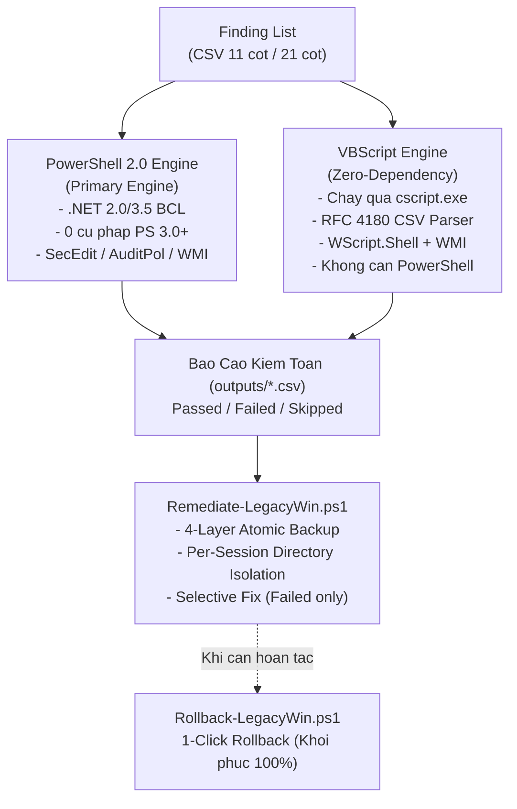

# HardeningLegacyWin

> Bộ công cụ kiểm toán (Audit) và thiết lập an toàn thông tin (Hardening) chuẩn CIS Benchmark cho hệ điều hành Windows Legacy (Dual-Engine: PowerShell 2.0+ & VBScript).


---

## Muc Luc

- [Gioi Thieu Tong Quan](#gioi-thieu-tong-quan)
- [Kien Truc Dual-Engine](#kien-truc-dual-engine)
- [Cau Truc Thu Muc](#cau-truc-thu-muc)
- [Cai Dat & Trien Khai](#cai-dat--trien-khai)
- [Huong Dan Su Dung](#huong-dan-su-dung)
  - [Buoc 1: Kiem Toan (Audit)](#buoc-1-kiem-toan-audit)
  - [Buoc 2: Mo Phong (What-If Simulation)](#buoc-2-mo-phong-what-if-simulation)
  - [Buoc 3: Khac Phuc Chon Loc (Selective Remediation)](#buoc-3-khac-phuc-chon-loc-selective-remediation)
  - [Buoc 4: Phuc Hoi 1-Click (Rollback)](#buoc-4-phuc-hoi-1-click-rollback)
- [Quy Chuan Du Lieu CSV](#quy-chuan-du-lieu-csv)
- [Kiem Dinh & Test Suites](#kiem-dinh--test-suites)
- [Chinh Sach An Toan](#chinh-sach-an-toan)
- [Giay Phep](#giay-phep)

---

## Gioi Thieu Tong Quan

Bo cong cu ma nguon mo danh cho cong tac kiem toan bao mat va thiet lap cau hinh an toan chuan hoa theo **CIS Benchmark** tren cac he dieu hanh Windows the he cu (Legacy Windows):
- **Windows 7 SP1** (Workstation)
- **Windows Server 2008 R2** (Server)
- **Windows Server 2012 / 2012 R2** (Server)

### Boi Canh Ky Thuat
Cac cong cu hardening hien dai (nhu *HardeningKitty*) duoc viet tren PowerShell 5.1 va yeu cau .NET Framework 4.5+ cung cac cmdlet moi (nhu `Get-ItemPropertyValue`, `Get-CimInstance`, `Get-LocalUser`). Khi thuc thi tren cac may chu cu chua duoc nang cap WMF 5.1:
1. Script bi crash ngay khi khoi dong do loi parser syntax hoac thieu cmdlet.
2. May bi khoa Execution Policy (`Restricted`) hoac co che bao ve chan chay file `.ps1`.
3. Co che tu dong sua loi (Remediation) thieu kha nang xoa cac Registry Key/Value moi tao khi can hoan tac (Rollback).

Giai phap nay khac phuc triet de cac van de tren bang kien truc **Dual-Engine** doc lap.

---

## Kien Truc Dual-Engine



1. **PowerShell 2.0 Engine (`src/Audit-LegacyWin.ps1`)**:
   - Tuong thich 100% voi PowerShell 2.0 mac dinh tren Windows 7 SP1 va Windows Server 2008 R2.
   - Tuyet doi khong su dung syntax PS 3.0+ (khong `[pscustomobject]`, `[ordered]`, `$PSScriptRoot`, `Get-CimInstance`).
   - Xu ly truc tiep file checklist 21 cot goc cua CIS Benchmark (324+ rules).
2. **VBScript Engine (`src/Audit-LegacyWin.vbs`)**:
   - Zero-dependency: Chay truc tiep qua `cscript.exe //nologo` co san tren moi he dieu hanh Windows.
   - Bo parser **RFC 4180 State Machine** xu ly chuan xac dau phay nam trong dau ngoac kep.
   - Anh xa cot dong (**Dynamic Header-to-Index Mapping**), tu dong thich ung voi moi cau truc cot.

---

## Cau Truc Thu Muc

```text
HardeningLegacyWin/
|-- lists/                                                 # Danh muc kiem toan CIS Benchmark (CSV)
|   |-- CIS_MS_Windows_Server_2008_R2_MS_Level_1_v3.3.1.csv# Baseline 21 cot goc (324 rules)
|   |-- finding_list_cis_server2008r2_machine.csv          # Baseline 11 cot Server 2008 R2
|   |-- finding_list_cis_win7_sp1_machine.csv              # Baseline 11 cot Windows 7 SP1
|   `-- finding_list_cis_server2012r2_machine.csv          # Baseline 11 cot Server 2012 R2
|-- src/                                                   # Ma nguon thuc thi
|   |-- Audit-LegacyWin.ps1                                # Engine Audit PowerShell 2.0 thuan
|   |-- Audit-LegacyWin.vbs                                # Engine Audit VBScript Zero-Dependency
|   |-- Remediate-LegacyWin.ps1                            # Engine Fix co kiem soat & 4-Layer Backup
|   |-- Rollback-LegacyWin.ps1                             # Engine Hoan tac 1-Click
|   `-- common/                                            # Thu vien ham dung chung (PS2)
|       |-- Compare-Value.ps1                              # Bo so sanh toan tu (=, !=, >=, <=, <=!0, regex)
|       |-- Parse-SecEdit.ps1                              # Xuat & phan tich secedit INF
|       `-- Parse-AuditPol.ps1                             # Thu thap & phan tich Advanced Audit Policy
|-- tests/                                                 # 8 Test Suites kiem dinh tu dong hoa
|   |-- Test-PS2Compat.ps1                                 # Static AST Linter: cam cu phap PS 3.0+
|   |-- Test-Audit-Smoke.ps1                               # Smoke test kiem chung schema bao cao
|   |-- Test-Rollback.ps1                                  # Integration Test: E2E Fix -> Rollback
|   |-- test_common_helpers.ps1                            # 68 unit tests toan tu & parser
|   |-- test_csv_schema.ps1                                # Kiem dinh toan ven file CSV
|   |-- test_audit_engine.ps1                              # 36 tests dispatch engine & parity
|   |-- test_remediate_rollback.ps1                        # 44 tests an toan backup & lockfile
|   `-- test_vbs_audit.ps1                                 # 17 tests VBScript Engine
|-- outputs/                                               # Thu muc luu bao cao va backup sessions
`-- tools/
    `-- accesschk.exe.url                                  # Shortcut Sysinternals AccessChk
```

---

## Cai Dat & Trien Khai

### 1. Tai ma nguon ve may quan tri
Giai nen ma nguon hoac clone kho luu tru ve may:
```cmd
git clone <repository_url>
cd HardeningNCS
```

### 2. Copy len may dich (Windows 7 / Server 2008 R2 / 2012 R2)
- **Qua mang (SSH / SCP):**
  ```bash
  scp -r src lists outputs tests vagrant@<IP_TARGET>:C:/HardeningNCS/
  ```
- **Moi truong Offline (Air-Gapped qua USB):**
  Copy toan bo thu muc vao USB va dan vao thu muc tren may dich (vi du: `C:\HardeningNCS`).

> **Luu y:** Chay Command Prompt hoac PowerShell duoi quyen **Run as Administrator** de co dac quyen `SeSecurityPrivilege` cho `secedit.exe` va `auditpol.exe`.

---

## Huong Dan Su Dung

### Buoc 1: Kiem Toan (Audit)

#### Cach A -- Chay bang PowerShell 2.0 (Khuyen nghi)
Su dung file baseline 21 cot goc chuan CIS Benchmark:
```powershell
powershell.exe -ExecutionPolicy Bypass -File .\src\Audit-LegacyWin.ps1 `
  -FindingList .\lists\CIS_MS_Windows_Server_2008_R2_MS_Level_1_v3.3.1.csv `
  -OutputDir .\outputs
```

#### Cach B -- Chay bang VBScript (Zero-Dependency)
Danh cho may bi khoa PowerShell Execution Policy:
```cmd
cscript.exe //nologo .\src\Audit-LegacyWin.vbs .\lists\CIS_MS_Windows_Server_2008_R2_MS_Level_1_v3.3.1.csv .\outputs
```

Bao cao duoc xuat ra tai `outputs\audit_report_<timestamp>.csv` gom 13 cot chi tiet.

---

### Buoc 2: Mo Phong (What-If Simulation)

Chay che do mo phong truoc de xac dinh cac muc se duoc sua, **khong thay doi bat ky cau hinh nao**:
```powershell
powershell.exe -ExecutionPolicy Bypass -File .\src\Remediate-LegacyWin.ps1 `
  -AuditReport .\outputs\audit_report_20261009_011408.csv `
  -FindingList .\lists\CIS_MS_Windows_Server_2008_R2_MS_Level_1_v3.3.1.csv `
  -WhatIf
```

---

### Buoc 3: Khac Phuc Chon Loc (Selective Remediation)

Khi da san sang, chay lenh sua that:
1. Chi tac dong vao cac muc co `Status = Failed`.
2. Tu dong kich hoat **Sao luu 4 lop (4-Layer Atomic Backup)** truoc khi ghi bat ky gia tri nao.
3. Tao thu muc session co lap `outputs\backup_session_yyyyMMdd_HHmmss_<PID>_<RND>` duoc khoa bang **Win32 Exclusive Lockfile**.
4. Neu co bat ky loi sao luu nao -> **Dung ngay lap tuc (Abort Gate)** va tu dong don sach file rac.

```powershell
powershell.exe -ExecutionPolicy Bypass -File .\src\Remediate-LegacyWin.ps1 `
  -AuditReport .\outputs\audit_report_20261009_011408.csv `
  -FindingList .\lists\CIS_MS_Windows_Server_2008_R2_MS_Level_1_v3.3.1.csv
```

---

### Buoc 4: Phuc Hoi 1-Click (Rollback)

Neu he thong phat sinh xung dot sau khi hardening, su dung file `backup_manifest.txt` duoc tao o Buoc 3 de hoan tac:

```powershell
powershell.exe -ExecutionPolicy Bypass -File .\src\Rollback-LegacyWin.ps1 `
  -ManifestFile .\outputs\backup_session_20261009_011952_1856_6325\backup_manifest.txt
```

**Co che phuc hoi:**
- Khoi phuc gia tri Registry cu qua file `.reg`.
- **Tu dong xoa sach cac Registry Key va Value moi tao** qua `registry_undo_delete.reg`.
- Nap lai Local Security Policy cu bang `secedit.exe /configure`.
- Nap lai Audit Policy cu bang `auditpol.exe /restore`.
- Khoi phuc che do khoi dong cua Windows Services theo snapshot.
- Dua he thong ve dung 100% trang thai truoc remediation.

---

## Quy Chuan Du Lieu CSV

### 1. Schema 21 Cot Goc (CIS Benchmark / HardeningKitty)
Bao toan nguyen ven 100% file goc:
```text
ID,Category,Name,Method,MethodArgument,RegistryPath,RegistryItem,RegistryPathIntune,RegistryPathDCP,RegistryItemIntune,ClassName,Namespace,Property,DefaultValue,DefaultValueIntune,RecommendedValue,RecommendedValueIntune,Operator,OperatorIntune,Severity,Filter
```

### 2. Schema 11 Cot Thu Gon (Machine Specific)
```text
ID,Category,Name,Method,MethodArgument,RegistryPath,RegistryItem,DefaultValue,RecommendedValue,Operator,Severity
```

### 3. Bang Phuong Thuc Kiem Toan (Method Adapters)

| Method | Mo Ta Kiem Toan | Nguon Thu Thap Du Lieu | Kha Nang Remediate |
| :--- | :--- | :--- | :---: |
| `Registry` | Doc khoa Registry he thong | Registry Provider / WMI StdRegProv |  |
| `service` | Che do khoi dong Windows Service | WMI `Win32_Service` (`StartMode`) |  |
| `secedit` | Chinh sach bao mat cuc bo | `secedit.exe /export` (`SECURITYPOLICY`) |  |
| `accountpolicy`| Chinh sach mat khau & lockout | `secedit` / fallback `net accounts` |  |
| `auditpol` | Nhat ky Advanced Audit Policy | `auditpol.exe /get /category:* /r` |  |
| `localaccount` | Trang thai tai khoan SID 500/501 | WMI `Win32_UserAccount` (`Disabled`, `Name`) |  |
| `accesschk` | Phan quyen User Rights Assignment | `secedit [Privilege Rights]` (Dich SID) | -yellow.svg) |
| `command` | Kiem tra phan mem bao mat (EMET) | Registry Uninstall Key (An toan) |  |

---

## Kiem Dinh & Test Suites

Du an tich hop san **8 bo test suite** tu dong hoa:

```powershell
# 1. Kiem tra 100% cu phap thuan PowerShell 2.0 (Cam PS 3.0+):
powershell -ExecutionPolicy Bypass -File .\tests\Test-PS2Compat.ps1

# 2. Kiem thu 68 unit tests cho toan tu va parser:
powershell -ExecutionPolicy Bypass -File .\tests\test_common_helpers.ps1

# 3. Kiem dinh toan ven schema CSV 11 cot va 21 cot goc:
powershell -ExecutionPolicy Bypass -File .\tests\test_csv_schema.ps1

# 4. Kiem thu 36 kich ban dispatch cua Audit Engine:
powershell -ExecutionPolicy Bypass -File .\tests\test_audit_engine.ps1

# 5. Kiem thu 17 kich ban cho VBScript Engine:
powershell -ExecutionPolicy Bypass -File .\tests\test_vbs_audit.ps1

# 6. Kiem thu 44 kich ban an toan Backup 4 lop, Lockfile va Rollback:
powershell -ExecutionPolicy Bypass -File .\tests\test_remediate_rollback.ps1

# 7. Smoke test kiem toan toan dien:
powershell -ExecutionPolicy Bypass -File .\tests\Test-Audit-Smoke.ps1

# 8. Integration test E2E thuc te tren Registry:
powershell -ExecutionPolicy Bypass -File .\tests\Test-Rollback.ps1
```

---

## Chinh Sach An Toan

- **Anti-Hang Protection**: Khong su dung vong lap vo han; cac tien trinh `secedit.exe` va `auditpol.exe` deu co co im lang `/quiet` va bat ngoai le chat che.
- **Chong False-Pass cho `accesschk`**: Khi thieu quyen thu thap `[Privilege Rights]`, cong cu danh dau ro `Skipped`, khong so sanh rong bang rong de bao `Passed` sai thuc te.
- **Co Lap Thu Muc Phien (Per-Session Isolation)**: Toan bo backup duoc luu trong `backup_session_*` rieng biet va khoa bang `FileMode.CreateNew` o cap OS Kernel, ngan ngua va cham giua cac phien chay dong thoi.
- **Chong Path Traversal**: Ten thu muc session duoc kiem tra nghiem ngat, chan cac ky tu `\`, `/`, `:`, `..` de khong ghi de ra ngoai thu muc `outputs/`.

---

## Giay Phep

Du an duoc phat hanh theo giay phep MIT License.
